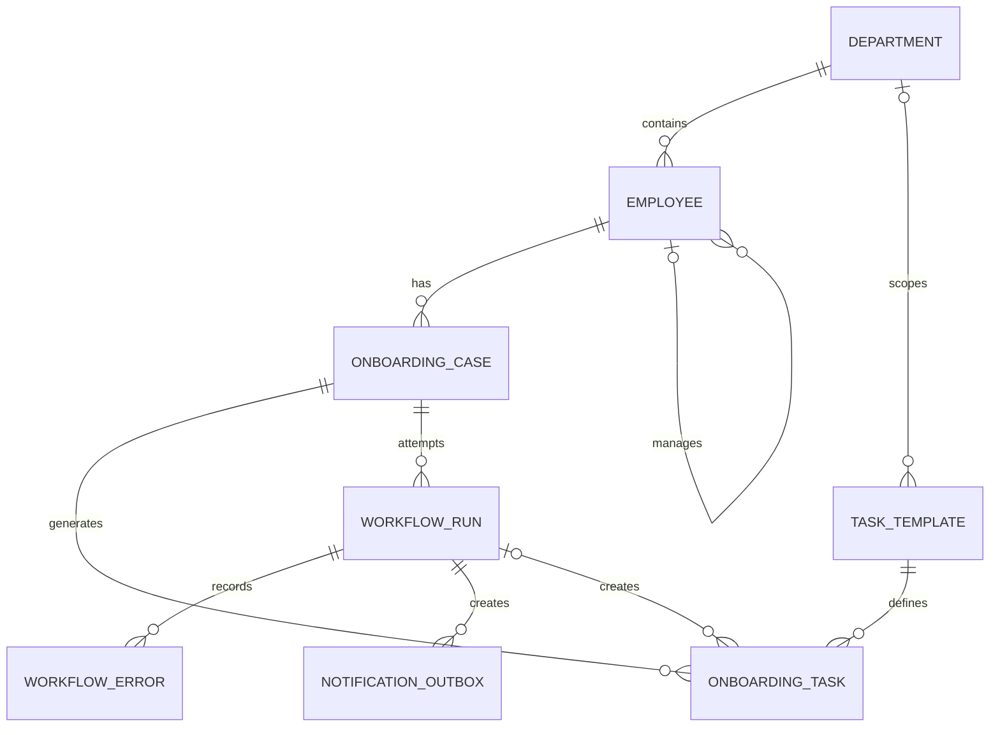

# Employee Onboarding Automation — Conceptual Data Model

## Purpose

Airtable is the HR-facing workspace. HR maintains employee, department, case, and template information there and sees generated tasks and exceptions.

PostgreSQL stores corresponding records with database constraints, plus workflow attempts, errors, and intended notifications. n8n moves information between the systems and processes onboarding cases. Shared identifiers let us compare records across Airtable and PostgreSQL.

## Entity relationships

A template without a department is global and applies to every department. A template linked to a department applies only to that department. The manager relationship is a link from one employee to another employee; all demonstration records use synthetic people.

A generated task is identified by the combination of its onboarding case and task template. A workflow run records the attempt that created a task, but a task is not recreated merely because a later attempt processes the same case.

## Airtable entities

| Entity | Purpose and main relationships | Who changes it |
|---|---|---|
| **Departments** | HR reference list. A department has employees and may have department-specific task templates. | HR |
| **Employees** | Synthetic employee details, including department, manager, and start date. An employee may have onboarding cases. | HR |
| **Onboarding Cases** | HR's request to generate onboarding tasks for one employee. Holds the operational state: Draft, Ready, Processing, Completed, or Failed. | HR creates and marks Ready; n8n changes processing outcomes |
| **Task Templates** | Reusable definitions of onboarding work, with an active flag, optional department, and deadline offset from the employee start date. | HR or project administrator |
| **Onboarding Tasks** | Tasks generated for a case from applicable templates. Each task links to its case and source template and has a calculated deadline. | n8n |
| **Automation Exceptions** | HR-visible explanations of failed or inconsistent processing. An exception points to the affected case and, where possible, the workflow attempt. | n8n |

Airtable linked records support navigation between employees, departments, cases, templates, tasks, and exceptions. HR views will make Ready and Failed cases easy to find.

## PostgreSQL entities

| Entity | Purpose and main relationships | Who changes it |
|---|---|---|
| **`departments`** | Department records corresponding to Airtable Departments. | n8n copies HR reference changes |
| **`employees`** | Employee records corresponding to Airtable Employees; references a department and, when present, a manager. | n8n copies HR changes |
| **`onboarding_cases`** | Case records corresponding to Airtable Onboarding Cases; references an employee and records a status for reporting and reconciliation. | n8n |
| **`task_templates`** | Templates corresponding to Airtable Task Templates; may reference one department or be global. | n8n copies template changes |
| **`onboarding_tasks`** | Generated tasks; each references a case and a template. The case-and-template combination is unique. A task may also reference the run that first created it. | n8n, subject to database constraints |
| **`workflow_runs`** | One record for each attempt to process a case, with timing and outcome. Earlier attempts remain after a retry. | n8n |
| **`workflow_errors`** | Specific errors associated with a workflow run and case. | n8n |
| **`notification_outbox`** | Intended notifications and their audit details. Records simulate delivery; no external message is sent. | n8n |

PostgreSQL constraints will enforce relationships and prevent duplicate generated tasks. The exact columns, types, and constraints belong in the later schema step.

## Cross-system identity and reconciliation

Each PostgreSQL record corresponding to an Airtable record stores that record's Airtable ID. This gives the two systems a stable way to refer to the same employee, department, case, template, or generated task. Names and titles are not suitable identifiers because HR may edit them.

For task generation, the durable business identity is **case plus template**. Before creating a task, n8n checks whether that case-and-template task already exists in each system. PostgreSQL also enforces uniqueness for this combination. If a task exists in only one system, the case remains incomplete and the missing copy can be created on retry.

The case status is shown to HR in Airtable and mirrored in PostgreSQL for reporting. Reconciliation compares case statuses and expected case-and-template tasks across both systems. Because PostgreSQL cannot directly query Airtable, a reconciliation run must first retrieve the relevant Airtable records and make their current identifiers and statuses available to the SQL report. The exact retrieval method will be defined during integration design.

## Example trace

For a synthetic employee in the Operations department:

1. HR creates an onboarding case linked to that employee.
2. n8n selects active global templates and active Operations templates.
3. n8n records a workflow run for the case.
4. Each generated task links to the case and its source template. Its deadline comes from the employee's start date and the template offset.
5. If processing fails, a workflow error records the reason and an Airtable Automation Exception makes it visible to HR.
6. A retry creates only missing case-and-template tasks. Earlier workflow runs and errors remain available for audit.