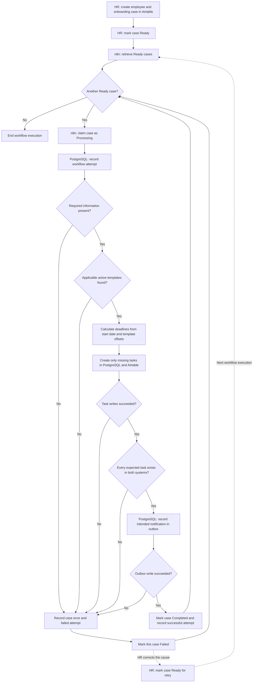

# Employee Onboarding Automation — Process

## Actors

- **HR** creates employees and onboarding cases in Airtable, marks prepared cases Ready, and corrects Failed cases.
- **n8n** coordinates processing. It handles each Ready case independently.
- **Airtable** shows case status, generated tasks, and errors to HR.
- **PostgreSQL** stores constrained records, workflow attempts, errors, and intended notifications.

Only one workflow execution processes Ready cases at a time in this project.

## Process diagram

The error path applies to a failure in validation, template selection, deadline calculation, task creation, final verification, or outbox recording. Processing the next case continues even if the current case fails.

## State-transition rules

| From | To | Actor | Condition |
|---|---|---|---|
| Draft | Ready | HR | HR has prepared the case and requests processing |
| Ready | Processing | n8n | n8n selects and claims the case |
| Processing | Completed | n8n | All expected tasks exist in Airtable and PostgreSQL, and the intended notification is recorded |
| Processing | Failed | n8n | Validation or another processing step cannot finish; the reason is recorded |
| Failed | Ready | HR | HR corrects the cause and requests another attempt |

No other transition is part of this project. In particular, a Completed case is not moved back to Ready.

## Failure and retry rules

Each time a case reaches Processing, the workflow records a distinct attempt. If the attempt fails, its error remains in the audit history after any later successful retry.

A task is uniquely identified by its onboarding case and task template. Before creating a task, the workflow checks whether that task already exists. PostgreSQL also enforces this identity with a unique constraint. If a task exists in one system but is missing from the other, the case does not become Completed. On retry, the workflow creates the missing copy and preserves the existing one.

For example, if a case requires three tasks but an attempt creates only the first task before failing, HR can return the case from Failed to Ready after the cause is corrected. The next attempt finds the first task, creates the other two, verifies all three in both systems, and then completes the case.

The diagram describes the normal failure path. A process stopped unexpectedly while a case is Processing cannot run its error-handling steps. We will document how to detect and recover such a stranded case when we design workflow operations and reconciliation.